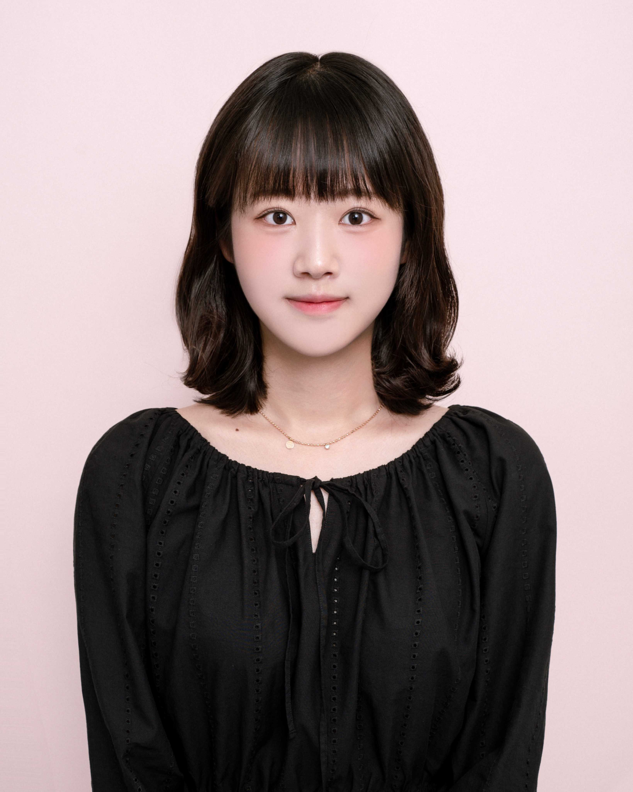
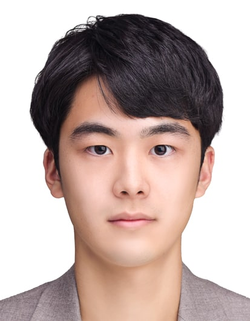
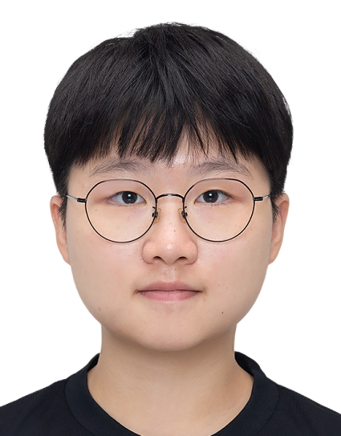

<!------->
<!--layout: default-->
<!--title: People-->
<!--permalink: /people/-->
<!------->
<!---->
<!--# Professor-->
<!------->
<!---->
<!--{: width="210" height="270"} Bohyoung Kim-->
<!---->
<!--3.5 0.7-->
<!--4.5 0.9-->
<!--# Interns-->
<!------->
<!---->
<!--{: width="210" height="270"} Jeonmin Rhee-->
<!--{: width="210" height="270"} Woojin Song-->
<!--{: width="210" height="270"} Seungjoo Lee-->
<!--{: width="210" height="270"} Yunjoo Oh-->
<!---->
<!---->
<!---->
<!--# Alumni-->
<!------->

---
layout: default
title: People
permalink: /people/
---

# People

---

## Professor

  
  Bohyoung Kim

---

## Interns

  

    
    Jeonmin Rhee
  

  

    
    Woojin Song
  

  

    
    Seungjoo Lee
  

  

    
    Yunjoo Oh
  

---

## Alumni

(Details about alumni can be added here.)

